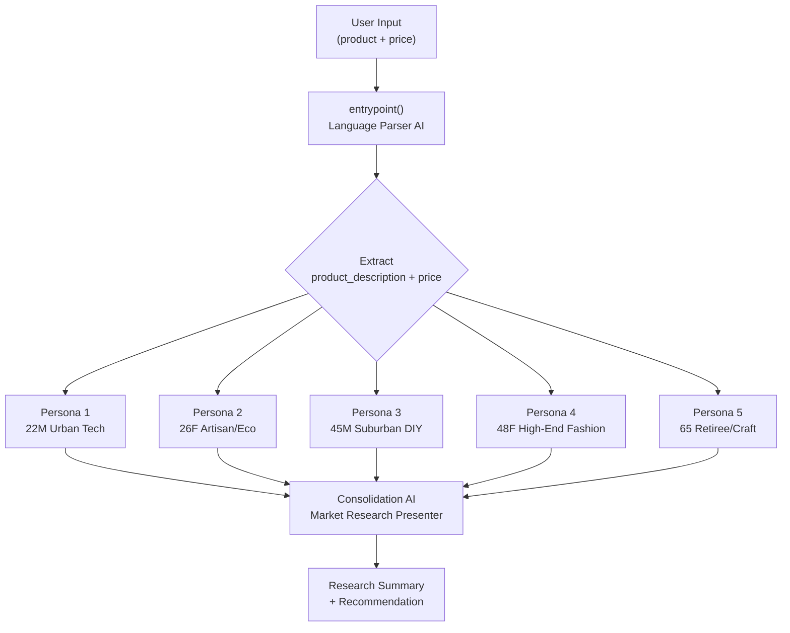
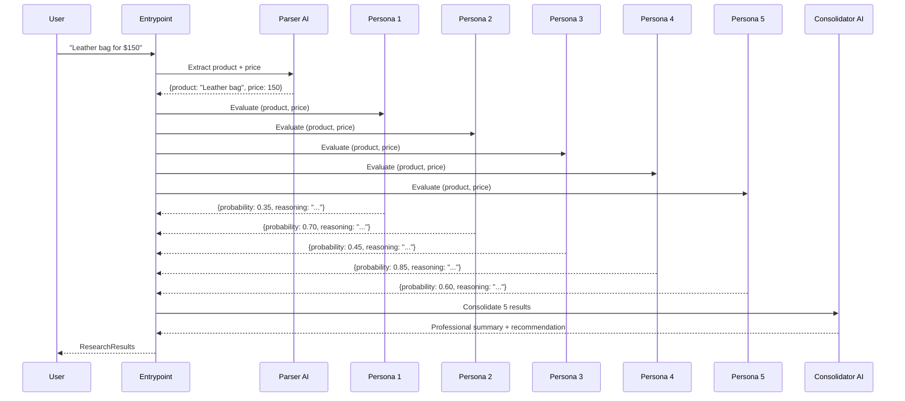
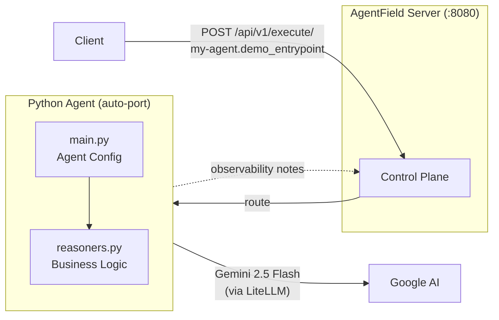

# Virtual People Market Analysis

An AI-powered market research system that simulates consumer behavior using **five distinct virtual personas**. Each persona independently evaluates a product and estimates their purchase probability, then results are consolidated into a professional market research summary.

Built on [AgentField](https://agentfield.ai/docs) with Gemini 2.5 Flash via LiteLLM.

## How It Works

The system takes a natural-language product description (e.g. *"Premium wireless headphones for $299"*), parses it into structured data, fans it out to five demographically diverse AI personas, and consolidates their independent evaluations into a single research report.



### Two-Stage AI Pipeline



## Virtual Personas

Each persona is a richly described consumer archetype that evaluates products through their own lens:

| Persona | Profile | Buying Style |
|---------|---------|--------------|
| **Agent 1** | 22M, urban (LA/NYC) | Tech-savvy, trend-driven, budget-conscious |
| **Agent 2** | 26F, artisan fair shopper | Sustainability-focused, supports small businesses |
| **Agent 3** | 45M, suburban homeowner (IL/OH) | Utility-driven, values long-term efficiency |
| **Agent 4** | 48F, East Coast boutique shopper | Quality over quantity, classic style, brand loyalty |
| **Agent 5** | 65, retiree at crafts market | Comfort and craftsmanship, heirloom quality |

Each returns a structured `PurchaseResults`:
- **probability** (0.0–1.0) — likelihood of purchase
- **reasoning** — explanation of their decision

## Architecture



## Quick Start

### Prerequisites
- Python 3.10+
- [AgentField CLI](https://agentfield.ai/docs) (`pip install agentfield`)
- A Gemini API key (or any LiteLLM-supported provider)

### Setup

```bash
# Clone and install
git clone <repo-url>
cd virtual_people_market_analysis
pip install -r requirements.txt

# Configure API key
cp .env.example .env
# Edit .env and add: GEMINI_API_KEY=your-key-here
```

### Run

```bash
# Terminal 1: Start the AgentField control plane
af server

# Terminal 2: Start the agent
python main.py
```

The agent auto-discovers an available port (starting from 8000) and registers with AgentField.

## API Usage

### Market Analysis (main endpoint)

```bash
curl -X POST http://localhost:8080/api/v1/execute/my-agent.demo_entrypoint \
  -H "Content-Type: application/json" \
  -d '{"input": {"message": "Premium leather messenger bag for $150"}}'
```

**Response:**
```json
{
  "summary": "Market research summary with consolidated findings from 5 personas and purchase recommendation..."
}
```

### Echo (health check, no AI required)

```bash
curl -X POST http://localhost:8080/api/v1/execute/my-agent.demo_echo \
  -H "Content-Type: application/json" \
  -d '{"input": {"message": "Hello World"}}'
```

## Project Structure

```
├── main.py              # Agent config, AI model setup, server startup
├── reasoners.py         # All reasoner functions (personas + orchestration)
├── requirements.txt     # Dependencies (agentfield)
└── .env.example         # Environment variable template
```

| File | Purpose |
|------|---------|
| `main.py` | Configures the Agent with node ID, AI model (Gemini 2.5 Flash), and temperature. Includes the reasoner router and starts the HTTP server. |
| `reasoners.py` | Defines the `entrypoint` orchestrator, 5 persona reasoners, Pydantic schemas (`PurchaseResults`, `PriceAndProductDescription`, `ResearchResults`), and observability hooks. |

## Tech Stack

| Component | Technology |
|-----------|-----------|
| Framework | [AgentField](https://agentfield.ai/docs) |
| AI Model | Gemini 2.5 Flash (via [LiteLLM](https://docs.litellm.ai/)) |
| Validation | [Pydantic](https://docs.pydantic.dev/) structured outputs |
| Runtime | Python 3.10+ with async/await |

## Learn More

- [AgentField Documentation](https://agentfield.ai/docs)
- [AgentField SDK Reference](https://agentfield.ai/docs/sdk)
- [LiteLLM Supported Providers](https://docs.litellm.ai/docs/providers)
